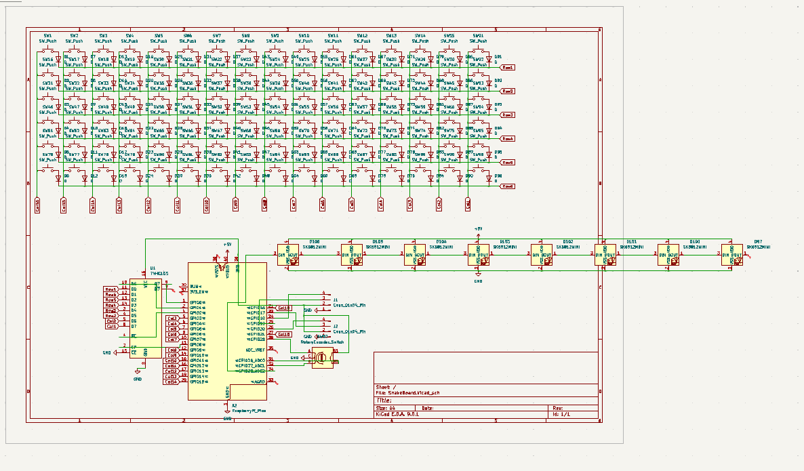
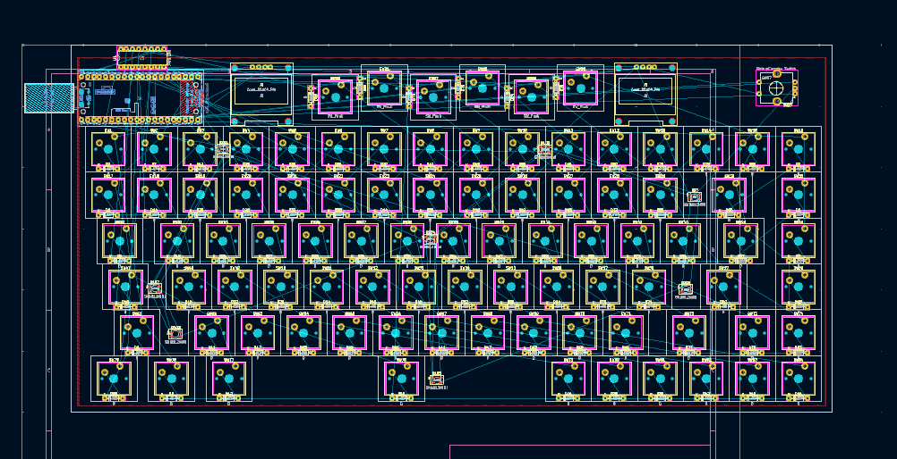
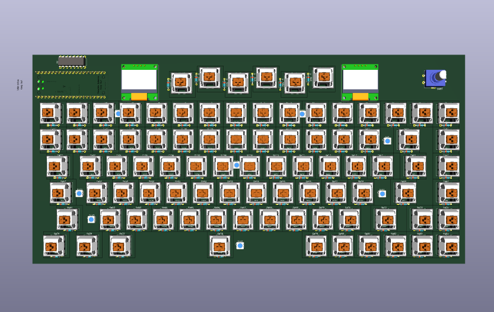
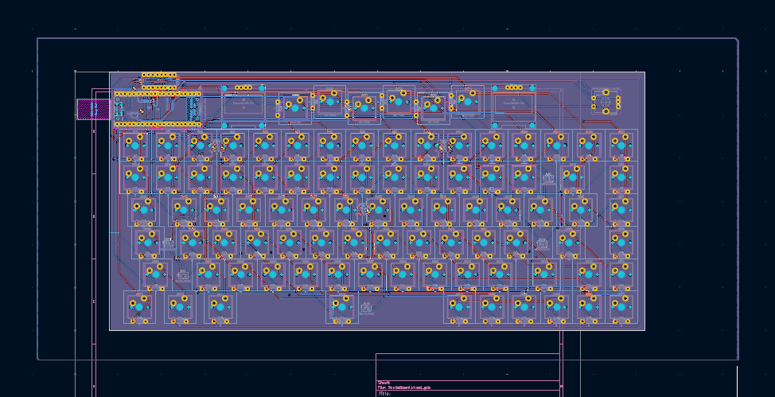

# 30/6/2025
I have made the schematic and finished it. search about the keyswetchs and where to buy it to add it to the BOM.

worked for 2 hours estimated but with the hackatime sickness it shows 23m :(.

In the same day but afternoon i add all the footprints and made the PCB and added the 3D designs and ramains only the ROUTINGGGG ;).

## spent total: 5 hours
# 1/7/2025
Finished routing the PCB and now it is all done. Only remains the Case now with onshape.

## total hours: 2 hours
# 10/7/2025
worked on the case and finished the basics but it needs more improvments

## total hours: 5 hours
# 23/7/2025 it's been so long because i had a problem but iam back.
Worked on improveing the case and enhancing its apperance and it is all now done.
I loved my name so much it is so cool on the case. I learned how to make a in context part studio so i can edit my case while i see my keyswitches locartion to add the holes.

The Onshape Doc: [DOC](https://cad.onshape.com/documents/902611e8b9feae564de8d9eb/w/ee044899b2f02c71afc87682/e/73f01ff6e236a97137583ab3?renderMode=0&uiState=688221b8a27d1511c8890300) 
## Total hours: 7 hours
